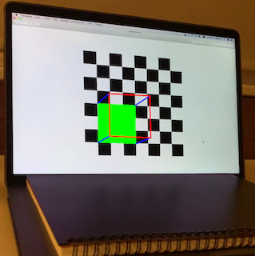
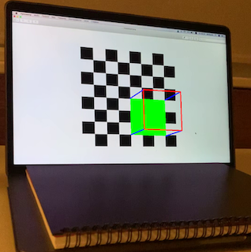
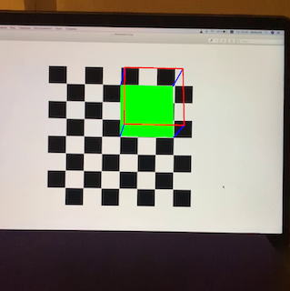

# The Match-Mover Project

**Professor**: Justus Piater, **authors**: Simon Rüba, Florian Maier, Daniel Kunis

1. [Preface](#preface)
2. [Objective](#objective)
3. [Camera internal calibration](#camera-internal-calibration)
4. [Inserting static shape into 3D scene using calibration rig](#rig-insertion)
5. [References](#references)

## Preface

This report presents our approach for solving typical problems in Visual Geometry and gained insights and observations.

## Objective

Insert an artificially rendered object into a movie such that everything is geometrically consistent (we will not worry about correct shading, occluders in front of the inserted object etc.).

## Camera internal calibration

The code for camera calibration is located in the `src/camera_calibration.py`. Below we will thoroughly describe the chosen algorithm.

In order to recover the camera matrix $P$:

1. We used the [OpenCV's sampled chessboard image](https://github.com/opencv/opencv/blob/master/samples/data/chessboard.png) as a sufficiently richly structured scene and took several photos of it that are located in the `resources/chessboard` folder of our project. The advantage of using a chessboard is that it establishes a new coordinate system within itself: we can address the internal corners of the chessboard like points where `(0, 0)` is the upper left internal corner. This significantly simplifies the problem of finding correspondences of points that we will use for finding $P$.

2. Now we consider each image one by one and find the coordinates of the corners of the chessboard using the [`cv2.findChessboardCorners`](https://docs.opencv.org/2.4/modules/calib3d/doc/camera_calibration_and_3d_reconstruction.html#findchessboardcorners) function. After the image coordinates of the corners are retrieved we improve their accuracy using [`cv2.cornerSubPix`](https://docs.opencv.org/2.4/modules/imgproc/doc/feature_detection.html#cv2.cornerSubPix). After iterating over all images we have two arrays: `obj_points` — with object points in the calibration pattern coordinate space; and `img_points` — projections of calibration pattern points for each image.

3. Solve the correspondences for $P$ using the [`cv2.calibrateCamera`](https://docs.opencv.org/2.4/modules/calib3d/doc/camera_calibration_and_3d_reconstruction.html#cv2.calibrateCamera) method. Under the hood it consists of 3 steps:

    1. *Initialization*. Compute an initial value for the camera matrix using DLT. Assume that distortion coefficients are zero.

    2. *Initial estimation*. Estimate the initial camera pose as if the intrinsic parameters have been already known using [`cv2.solvePnP`]().

    3. *Iterative optimization*. Minimize the reprojection error using the Levenberg-Marquardt optimization algorithm.

    The reprojection error is a geometric error and it is the mean value of squared distances between the observed projections `img_points` (that were retrieved by the corner finding algorithm) and the projected (using `cv2.projectPoints`) `obj_points`.

The described method is alike the *Gold Standard* algorithm described in [HZ](#HZ) in 4.5 (p114).

**Observation 1**: During our first iteration we used the [chessboard images provided by OpenCV](https://github.com/opencv/opencv/blob/master/samples/data/left01.jpg) which are of size `640x480`. After switching to images made by our camera without changing any of the parameters we saw an excessive rise in the error (from `0.024` up to `0.5`) even though the quality and number of input images was increased from `13` up to `262` and we were expecting an error decrease. The explanation of this rise was that our new images were much bigger — `3024x4032` — and the [`cv2.cornerSubPix`](https://docs.opencv.org/2.4/modules/imgproc/doc/feature_detection.html#cv2.cornerSubPix) function could not find the absolute minimum within the given boundaries (we specify `winSize` which is half of the side length of the search window) since the search window became relatively smaller to overall image size. We solved it by resampling large input images that are bigger than `1920x1080` using the [`cv2.resize`](https://docs.opencv.org/2.4/modules/imgproc/doc/geometric_transformations.html#resize) using the `INTER_AREA` interpolation method which is considered best for downsampling. This greatly improved  the result — reprojection error became `0.141`.

## Inserting static shape into 3D scene using calibration rig 

In the beginning, as a first iteration, we decided to insert a cube into a 3D scene using a calibration rig which greatly simplifies the objective since we can use the chessboard as the coordinate system and we can easily find the point correspondences.

The implementation of this step can be found in `src/draw_cube_chessboard.py` and can be decomposed into these steps:

  1. Convert input video to image sequence.
  2. Iterate over all images and for each find the corners of the chessboard using [`cv2.findChessboardCorners`](https://docs.opencv.org/2.4/modules/calib3d/doc/camera_calibration_and_3d_reconstruction.html#findchessboardcorners), calculate the pose of the chessboard using RANSAC algorithm (implmetned in the [`cv2.solvePnPRansac`](https://docs.opencv.org/2.4/modules/calib3d/doc/camera_calibration_and_3d_reconstruction.html?highlight=solvepnpransac#solvepnpransac) function), project the 3D points of the cube (in chessboards' coordinate system) to the 2D image plane, draw the cube and save the image.
  3. Convert the image sequence to a video.

We chose RANSAC because of it's robustness and resistance to outliers.

**Observation 2**: Do not use a square chessboard pattern. It might sound obvious, but we did not think of it in the beginning. Using a symmetrical rig confuses the algorithm and corrupts camera calibration and can be revealed only during the drawing of the cube.

Consider this image sequence. All of them are from the same video.

|  |  |  |
|---|---|---|

## References

1.  [HZ] - [R. Hartley, A. Zisserman, Multiple View Geometry in Computer Vision, 2nd edition, Cambridge University Press 2003](http://www.robots.ox.ac.uk/~vgg/hzbook/)
